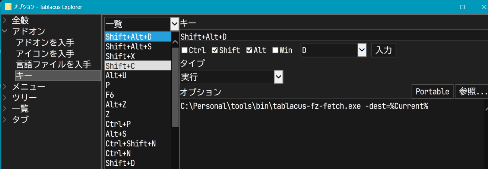

# README

This repository is no longer maintained. Use [AWtnb/tablacus-fz-send](https://github.com/AWtnb/tablacus-fz-send) instead.

---

Command line tool for [Tablacus Explorer](https://tablacus.github.io/explorer.html).

- List up files on specified directory (default: `Desktop`) and select with fuzzy-finder.
- Selected files are copied to specified directory
- If necessary, you can remove original files (like file explorer's CUT & PASTE).

